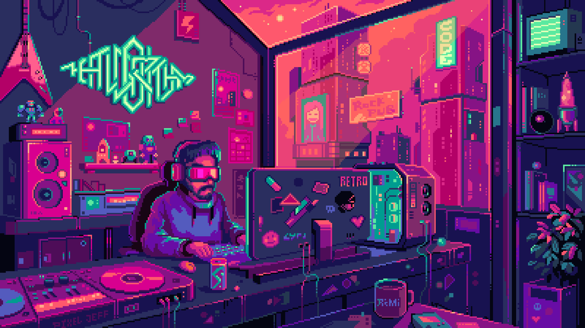
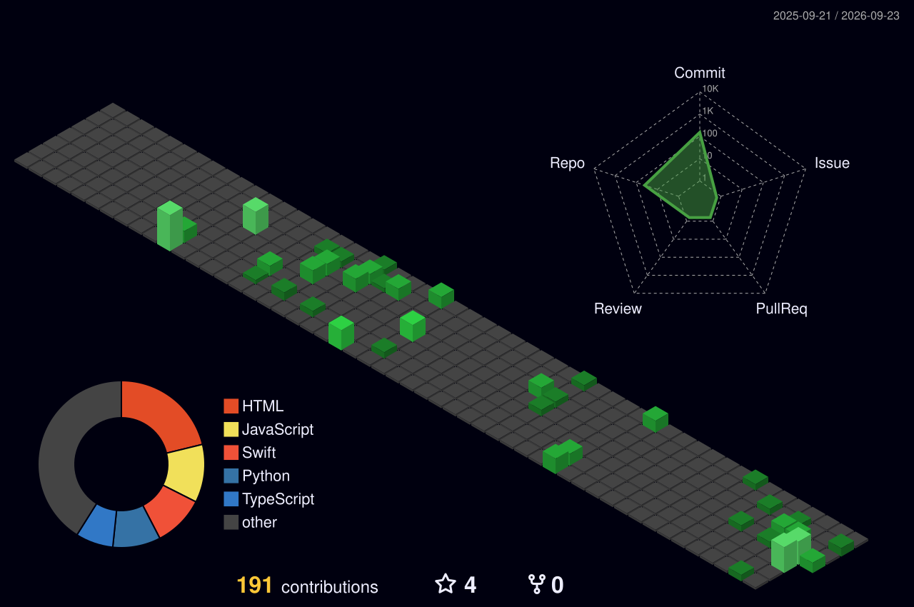

# Hi there, I'm Kunal! 

  

---

### 👨‍💻 About Me

- 🔭 I’m currently working on **Advanced Web Applications**
- 🌱 I’m currently learning **AI Agents & Machine Learning**
- 👯 I’m looking to collaborate on **Open Source Projects**
- 💬 Ask me about **React, Node.js, Python, and System Design**
- 📫 How to reach me: **kunallubhana77@gmail.com**
- ⚡ Fun fact: **I can center a div in my sleep!**

 

---

### 🛠️ Tech Stack

| Frontend | Backend | Tools & DevOps |
| :---: | :---: | :---: |
|  |  |  |
|  |  |  |
|  |  |  |
|  |  |  |

---

### 📊 GitHub Stats

  <table align="center">
    <tr>
      <td>
        
      </td>
      <td>
        
      </td>
    </tr>
  </table>
   
  

---

### 3D Contribution Graph

  

---

### 🏆 Trophies

  

---

### 🤝 Connect with Me

  
  
  

   
  

